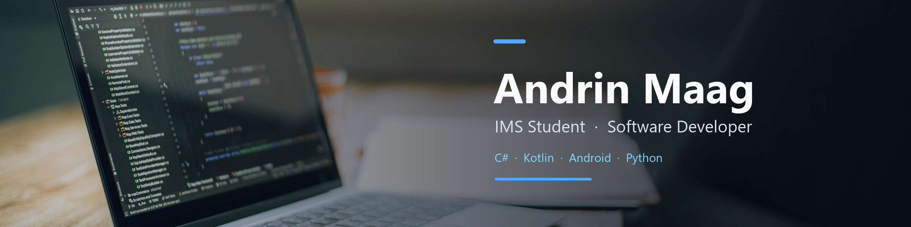

<picture>
  <source media="(prefers-color-scheme: dark)" srcset="assets/profile-header-workspace-hq.png">
  <source media="(prefers-color-scheme: light)" srcset="assets/profile-header-workspace-light.png">
  
</picture>

  

<strong>English</strong> · View profile in English

  <a href="#about-me"><kbd>About</kbd></a>
  <a href="#selected-projects"><kbd>Projects</kbd></a>
  <a href="#technology"><kbd>Technology</kbd></a>
  <a href="#how-i-work"><kbd>Workflow</kbd></a>
  <a href="#currently-learning"><kbd>Learning</kbd></a>

## About Me

I am an IMS student from Aargau who develops practical software with clear interfaces and maintainable code. My current focus is C#, Kotlin, Android, and Python. I enjoy turning a concrete problem into a structured implementation, testing it carefully, and refining the result until it is useful in everyday life.

| Current focus | Details |
| --- | --- |
| Education | IMS student combining business education with software development |
| Location | Aargau, Switzerland |
| Interests | Android applications, C# projects, data analysis, and dependable user experiences |
| Opportunity | Open to IMS internships and learning opportunities in Switzerland |

## Selected Projects

### [Exam Countdown](https://github.com/Momik-jpg/TestColdown)

An Android application that brings exam dates, schedules, reminders, widgets, grade calculations, and iCal synchronisation into one focused workflow. The project demonstrates local data handling, encrypted settings, time-based behaviour, and careful attention to a practical mobile interface.

`Kotlin` `Android` `Widgets` `iCal` `Local storage`

### [Orbit Defender](https://github.com/Momik-jpg/orbit-defender-monogame)

A real-time MonoGame project built around a structured game loop, collision services, increasing difficulty, and persistent JSON high scores. It shows how I separate responsibilities, manage continuously changing state, and turn gameplay rules into testable C# components.

`C#` `.NET 8` `MonoGame` `JSON` `Game architecture`

### [CO2 Data Analysis](https://github.com/Momik-jpg/LB259)

A documented analysis of public emissions data, including data cleaning, source attribution, privacy decisions, regression visualisations, and model predictions. The repository presents both the analytical process and the reasoning behind the dataset choices.

`Python` `Jupyter Notebook` `Pandas` `Regression` `Data visualisation`

## Technology

  
  
  
  
  
  
  
  

## How I Work

- **Understand:** clarify the problem, constraints, and expected user experience.
- **Structure:** divide larger features into focused responsibilities and verifiable steps.
- **Build:** prefer readable code and existing platform conventions over unnecessary complexity.
- **Verify:** test technical behaviour, edge cases, and the experience from a user's perspective.
- **Document:** keep decisions and setup instructions understandable for the next person.

## Currently Learning

- Building maintainable Android applications with Kotlin
- Structuring larger C# and .NET projects with clear responsibilities
- Improving automated tests, documentation, accessibility, and release quality
- Presenting technical decisions clearly in both German and English

---

  Open to IMS internships, learning opportunities, and interesting software projects in Switzerland. 
  <a href="https://github.com/Momik-jpg?tab=repositories"><strong>Explore my repositories</strong></a>

<strong>Deutsch</strong> · Profil auf Deutsch anzeigen

  <a href="#über-mich"><kbd>Über mich</kbd></a>
  <a href="#ausgewählte-projekte"><kbd>Projekte</kbd></a>
  <a href="#technologien"><kbd>Technologien</kbd></a>
  <a href="#meine-arbeitsweise"><kbd>Arbeitsweise</kbd></a>
  <a href="#aktuell-lerne-ich"><kbd>Lernen</kbd></a>

## Über mich

Ich bin IMS-Schüler aus dem Aargau und entwickle praktische Software mit klaren Benutzeroberflächen und wartbarem Code. Mein aktueller Fokus liegt auf C#, Kotlin, Android und Python. Ich setze gerne ein konkretes Problem strukturiert um, teste die Lösung sorgfältig und verbessere sie, bis sie im Alltag wirklich nützlich ist.

| Aktueller Fokus | Details |
| --- | --- |
| Ausbildung | IMS-Schüler mit kaufmännischer Ausbildung und Softwareentwicklung |
| Standort | Aargau, Schweiz |
| Interessen | Android-Apps, C#-Projekte, Datenanalyse und zuverlässige Benutzererlebnisse |
| Möglichkeit | Offen für IMS-Praktika und Lernmöglichkeiten in der Schweiz |

## Ausgewählte Projekte

### [Exam Countdown](https://github.com/Momik-jpg/TestColdown)

Eine Android-App, die Prüfungstermine, Stundenplan, Erinnerungen, Widgets, Notenberechnungen und iCal-Synchronisation in einem fokussierten Ablauf verbindet. Das Projekt zeigt lokale Datenverarbeitung, verschlüsselte Einstellungen, zeitabhängiges Verhalten und meine Aufmerksamkeit für eine praktische mobile Benutzeroberfläche.

`Kotlin` `Android` `Widgets` `iCal` `Lokale Daten`

### [Orbit Defender](https://github.com/Momik-jpg/orbit-defender-monogame)

Ein Echtzeitspiel auf Basis von MonoGame mit strukturiertem Game Loop, Kollisionsdiensten, steigendem Schwierigkeitsgrad und persistenten JSON-Highscores. Es zeigt, wie ich Zuständigkeiten trenne, laufend veränderten Zustand verwalte und Spielregeln in überprüfbare C#-Komponenten übersetze.

`C#` `.NET 8` `MonoGame` `JSON` `Spielarchitektur`

### [CO2 Data Analysis](https://github.com/Momik-jpg/LB259)

Eine dokumentierte Analyse öffentlicher Emissionsdaten mit Datenbereinigung, Quellenangaben, Datenschutzentscheiden, Regressionsvisualisierungen und Modellprognosen. Das Repository zeigt sowohl den Analyseprozess als auch die Begründung hinter den Entscheidungen zum Datensatz.

`Python` `Jupyter Notebook` `Pandas` `Regression` `Datenvisualisierung`

## Technologien

  
  
  
  
  
  
  
  

## Meine Arbeitsweise

- **Verstehen:** Problem, Einschränkungen und erwartetes Benutzererlebnis klären.
- **Strukturieren:** grössere Funktionen in klare Zuständigkeiten und überprüfbare Schritte aufteilen.
- **Umsetzen:** lesbaren Code und bestehende Plattformkonventionen unnötiger Komplexität vorziehen.
- **Überprüfen:** technisches Verhalten, Randfälle und die Bedienung aus Sicht der Benutzerinnen und Benutzer testen.
- **Dokumentieren:** Entscheidungen und Einrichtung so festhalten, dass sie für die nächste Person verständlich bleiben.

## Aktuell lerne ich

- Wartbare Android-Apps mit Kotlin entwickeln
- Grössere C#- und .NET-Projekte mit klaren Zuständigkeiten strukturieren
- Automatisierte Tests, Dokumentation, Barrierefreiheit und Release-Qualität verbessern
- Technische Entscheidungen auf Deutsch und Englisch verständlich präsentieren

---

  Offen für IMS-Praktika, Lernmöglichkeiten und interessante Softwareprojekte in der Schweiz. 
  <a href="https://github.com/Momik-jpg?tab=repositories"><strong>Meine Repositories ansehen</strong></a>

