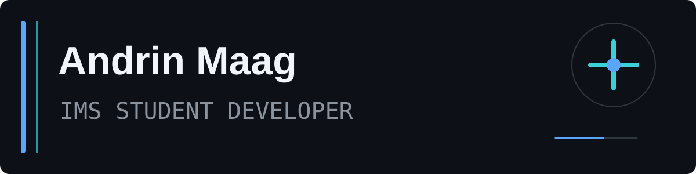

## Hallo, ich bin Andrin

Ich entwickle praktische Software mit klaren Benutzeroberflächen und lege Wert auf verständlichen, wartbaren Code. Als IMS-Schüler vertiefe ich aktuell meine Kenntnisse in C#, Kotlin und Android-Entwicklung und bringe Projekte vom ersten Konzept bis zu einer nutzbaren Version.

## Hello, I'm Andrin

I build practical software with clean interfaces and maintainable code. My current focus is C#, Kotlin, Android development, and turning ideas into reliable, usable software.

## Featured Projects

| Project | What it demonstrates | Stack |
| --- | --- | --- |
| [**Exam Countdown**](https://github.com/Momik-jpg/TestColdown) | Android app for exams, schedules, reminders, widgets, grade calculations, encrypted local settings, and iCal synchronisation. | Kotlin, Android |
| [**Orbit Defender**](https://github.com/Momik-jpg/orbit-defender-monogame) | Real-time game with a structured game loop, collision services, increasing difficulty, and persistent JSON high scores. | C#, .NET 8, MonoGame |
| [**CO2 Data Analysis**](https://github.com/Momik-jpg/LB259) | Exploration of public emissions data with documented data protection decisions, source attribution, and a cleaned dataset. | Python, Jupyter Notebook |

## Skills & Tools

  
  
  
  
  
  

## Currently Learning

- Building maintainable Android applications with Kotlin
- Structuring larger C# projects with clear responsibilities
- Improving testing, documentation, and release quality

---

  Open to learning opportunities, IMS internships, and interesting software projects in Switzerland.

